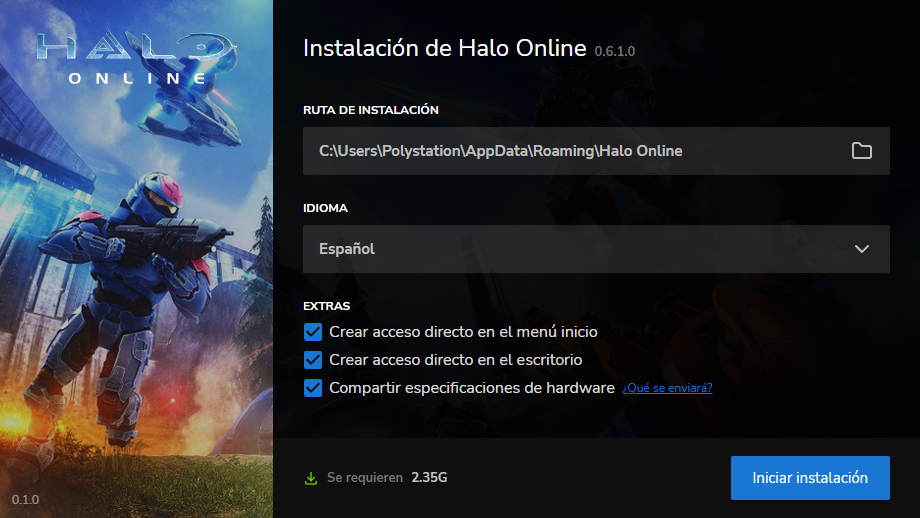

<p align="center">
  
</p>


# Halo Online Setup
Un simple, potente y bonito instalador para el juego Halo Online, dado que no encontré uno adecuado en la red, pues decidí desarrollar uno, como para no aburrirme luego del trabajo 😁

## Descarga

[**https://haloonline.net**](https://haloonline.net) 👈👈👈

## Previsualización



> Es un instalador online, por lo cual necesita internet para poder instalar el juego.

### Tecnologías usadas
- [Node JS](https://nodejs.org/es/)
- [Tauri JS](https://tauri.studio)
- [React JS](https://es.reactjs.org)
- [MUI](https://mui.com/)

### Compilación
**Pre requisitos**: 
- Instalar [Node JS](https://nodejs.org/es/) y los paquetes necesarios con **"npm install" o "yarn"**.
- Instalar los requerimientos que se muestre en la página de documentación de "Tauri JS" (enlace más arriba). 
- Crear el archivo **.env** en la rais del proyecto, un ejemplo lo tenemos en el archivo **.env.example**


Ahora, para ya compilar tiramos uno de los siguientes comandos: 

```javascript
yarn tauri build

- o -

npm run tauri build
```

**Y listo!** a instalar el Halo Online y disfrutar jugando.
